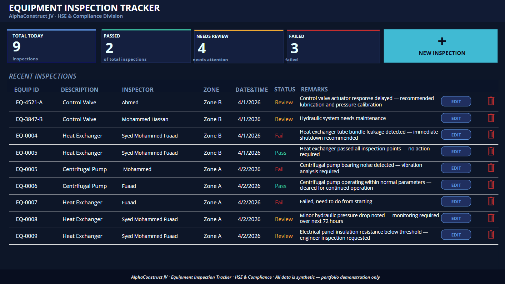
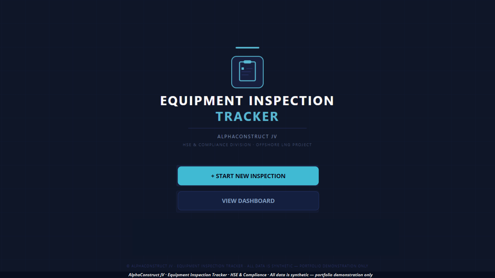
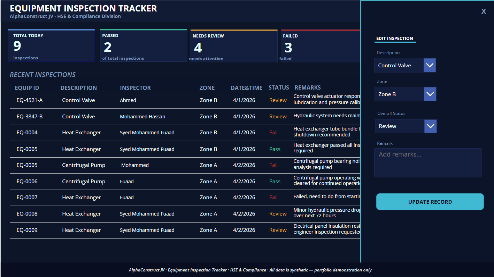
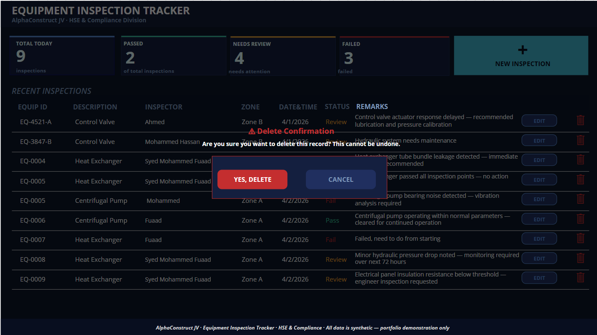
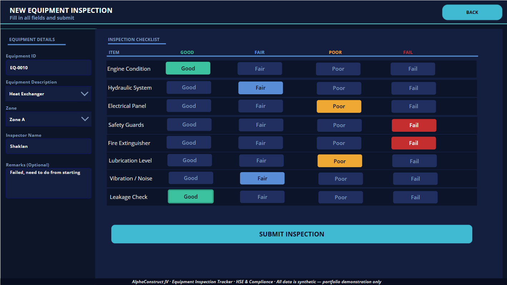
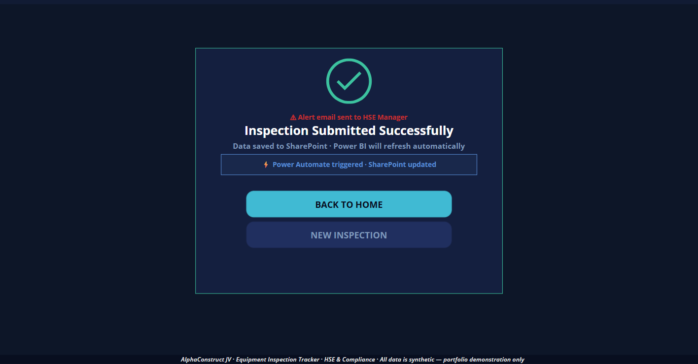
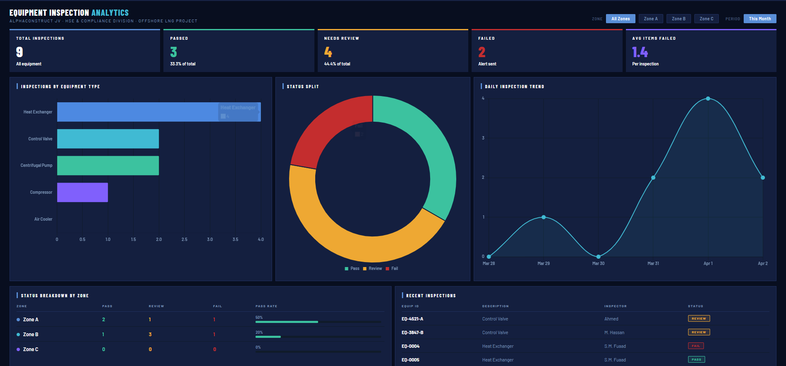

# Equipment Inspection Tracker — Power Apps Portfolio Project

> Full CRUD Power Apps canvas app for industrial equipment 
> inspection management — built for an HSE & Compliance division 
> on a major offshore LNG construction project.



---

## 🔍 Business Problem
HSE teams in large-scale industrial construction environments 
needed a mobile-friendly digital inspection system to replace 
manual paper checklists — with automatic alerts when equipment 
items fail inspection.

---

## 💡 What Was Built

### Power Apps (Canvas App — 4 Screens)
- **Home screen** — branded splash with quick launch buttons
- **Dashboard** — live KPI cards (Total, Passed, Review, Failed) + inspection gallery
- **Inspection Form** — 8-item checklist with Good/Fair/Poor/Fail rating buttons
- **Success Screen** — confirmation with Power Automate trigger status
- Auto-generated Equipment ID on every submission
- Auto-filled Inspector Name via `User().FullName`
- Overall Status auto-calculated — Pass / Review / Fail
- Full CRUD operations:
  - **Create** — new inspection form with 8-item checklist
  - **Read** — live gallery showing all records with colour-coded status
  - **Update** — inline edit panel slides in from right — no screen navigation needed. Edit description, zone, overall status and remarks
  - **Delete** — trash icon on each row triggers confirmation popup before permanent deletion
- Conditional colour coding throughout — green Pass, amber Review, red Fail
- Delete confirmation popup — prevents accidental deletions

### SharePoint Online
- `Equipment_Inspections` list — 16 columns
- Stores all inspection records in real time
- Direct connector to Power Apps

### Power Automate
- Triggered on every new submission
- Sends alert email if Overall Status is Review or Fail
- Updates `Alert_Sent` column automatically

### Power BI
- Connected to SharePoint Equipment Inspections list
- KPI cards — Total, Passed, Review, Failed, Avg Items Failed
- Bar chart — inspections by equipment type
- Donut chart — Pass/Review/Fail status split
- Line chart — daily inspection trend
- Status breakdown by zone table
- Recent inspections table with colour badges

---

## 🛠️ Tools & Stack
Power Apps | SharePoint Online | Power Automate | Power BI

---

## 📐 Data Flow
```
Inspector submits form (Power Apps)
        ↓
Record saved to SharePoint list
        ↓
Power Automate triggered
        ↓
Alert email sent to HSE Manager (if Review/Fail)
        ↓
Power BI dashboard refreshes automatically
```

---

## 📸 Screenshots

### Home Screen


### Dashboard


### Edit Panel


### Delete Confirmation


### Inspection Form


### Success Screen


### Power BI Dashboard



---

## ⚠️ Data Note
All data shown is fully synthetic — no real company, project, 
or individual data is used. Generated for portfolio 
demonstration purposes only.

---

## 👤 Author
**Syed Mohammed Fuaad**
Power BI & Automation Analyst | Qatar
[GitHub](https://github.com/f4fuaad) | [LinkedIn](https://www.linkedin.com/in/syed-fuaad)
